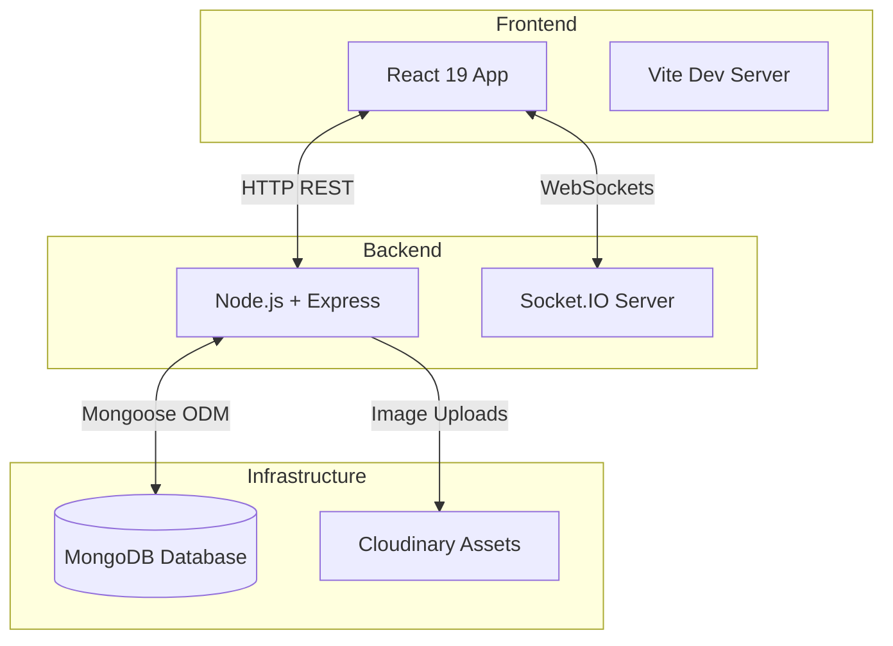
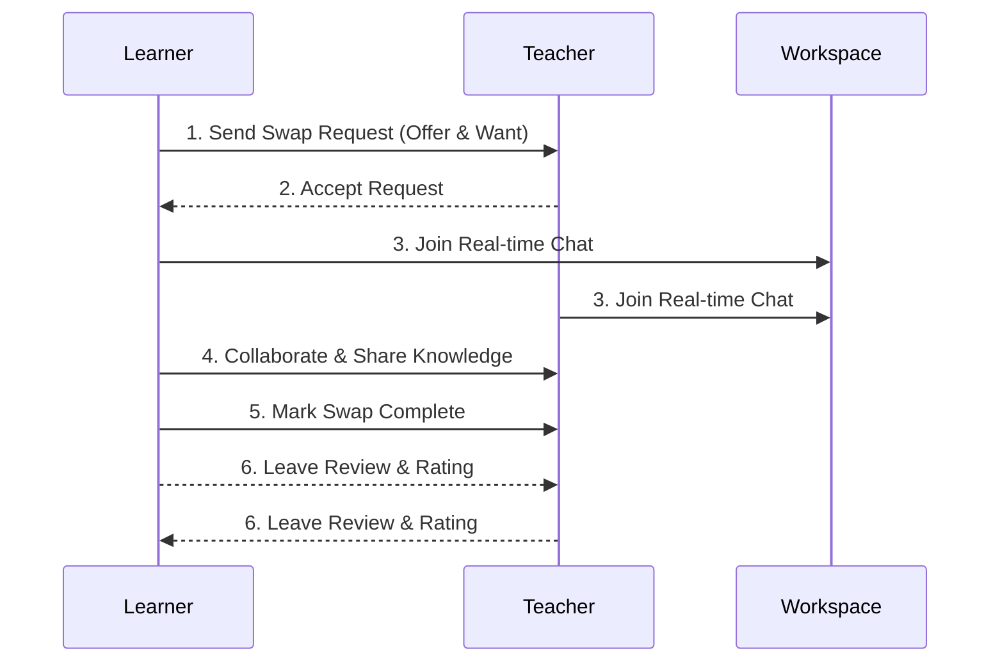

<div align="center">
  
  <h1>SkillSwap</h1>
  <p><strong>Trade What You Know. Learn What You Don't.</strong></p>
  <p><h3>🌐 <a href="https://skillswapv2.vercel.app/">Live Website: skillswapv2.vercel.app</a></h3></p>
  
  <p>
    
    
    
    
  </p>
  <br/>
  <br/>
  <a href="https://pagespeed.web.dev/analysis/https-skillswapv2-vercel-app/y9pdzou3qy?form_factor=desktop" target="_blank">
    
    
    
    
  </a>
</div>

<br/>

> SkillSwap is a peer-to-peer skill exchange platform where professionals connect, swap expertise, and grow together. Instead of paying for courses or tutoring, you trade your skills directly with others — you teach what you know and learn what you don't.

---

## Table of Contents
- [Why SkillSwap?](#why-skillswap)
- [Features](#features)
- [System Architecture](#system-architecture)
- [Getting Started](#getting-started)
- [Project Structure](#project-structure)
- [Contributing](#contributing)

---

## Why SkillSwap?
Traditional learning platforms require you to pay for expensive courses or tutors. SkillSwap believes that **everyone has something to teach and something they want to learn**. 
- **Zero Cost:** Pay with your time and knowledge, not your wallet.
- **Learn by Doing:** 1-on-1 personalized mentorship is the fastest way to learn.
- **Build your Network:** Connect with ambitious professionals across the globe.

---

## Features

### Core Flow
- **Browse & Match** — Discover users by skill category with smart match scoring and mutual-match detection
- **Swap Requests** — Propose a skill exchange specifying what you offer and what you want in return
- **Real-time Workspaces** — Chat, set goals, and track progress together via Socket.IO
- **Completion & Reviews** — Mark swaps complete, leave ratings and feedback

### Gamification
- **Leagues** — Bronze → Silver → Gold → Platinum → Diamond based on rating × review count
- **Badges** — Early Bird, Team Player, Super Mentor, and more
- **Leaderboard** — Top-ranked users with percentile and league distribution

### Teams
- Create teams (2–4 people) with shared goals, invite members, and work together in a dedicated workspace

### Admin Dashboard
- Platform analytics (total users, swaps, teams, reviews)
- User & Team management
- Emergency data reset

---

## System Architecture



## The Swap Lifecycle



---

## Getting Started

### Prerequisites
- Node.js 20+
- MongoDB running locally on `mongodb://localhost:27017`

### 1. Installation
```bash
# Clone the repo
git clone https://github.com/your-username/skillswap.git
cd skillswap

# Install backend dependencies
cd server
npm install

# Install frontend dependencies
cd ../client
npm install
```

### 2. Environment Variables
Create `server/.env`:
```env
PORT=5000
MONGO_URI=mongodb://localhost:27017/skillswap
JWT_SECRET=your_jwt_secret_here
CLOUDINARY_CLOUD_NAME=your_cloud_name
CLOUDINARY_API_KEY=your_api_key
CLOUDINARY_API_SECRET=your_api_secret
```
*(Cloudinary credentials are optional — avatar uploads will fail without them, but the app runs fine otherwise.)*

### 3. Running Locally
```bash
# From the server directory — start the backend
cd server
npm run dev

# In a separate terminal — start the frontend
cd client
npm run dev
```
The client runs on `http://localhost:5173` and proxies `/api` requests to `http://localhost:5000`.

---

## Project Structure

<details>
<summary>Click to see full directory tree</summary>

```
skillswap/
├── client/                      # React frontend
│   ├── public/                  # Static files & Favicon
│   └── src/                     # React Source
│       ├── api/                 # Axios configuration
│       ├── components/          # Reusable UI components
│       ├── context/             # React Context (Auth, Theme, Socket)
│       ├── pages/               # Route components (Landing, Profile, etc.)
│       └── utils/               # Shared constants, helpers, and styles
├── server/                      # Express backend
│   ├── middleware/              # Auth and Admin role checks
│   ├── models/                  # Mongoose Schemas (User, Swap, Team, etc.)
│   ├── routes/                  # Express route controllers
│   ├── services/                # Business logic (Gemini AI, gamification, matching)
│   └── utils/                   # Server utilities and constants
```
</details>

---

## API Overview

| Route | Auth | Description |
|---|---|---|
| `POST /api/auth/register` | No | Create account |
| `POST /api/auth/login` | No | Sign in |
| `GET /api/auth/me` | Yes | Current user |
| `GET /api/users` | Yes | Browse users (paginated, filterable) |
| `GET/PUT /api/users/:id` | Yes | Get/update profile |
| `GET/POST /api/swaps` | Yes | List/create swap requests |
| `PUT /api/swaps/:id/complete` | Yes | Request completion |
| `GET /api/teams` | Yes | List teams |
| `POST /api/teams` | Yes | Create team |
| `GET /api/leaderboard` | Yes | Top 20 rankings |

---

## Contributing

Contributions make the open source community such an amazing place to learn, inspire, and create. Any contributions you make are **greatly appreciated**.

1. Fork the Project
2. Create your Feature Branch (`git checkout -b feature/AmazingFeature`)
3. Commit your Changes (`git commit -m 'Add some AmazingFeature'`)
4. Push to the Branch (`git push origin feature/AmazingFeature`)
5. Open a Pull Request

---

## License

Distributed under the MIT License. See `LICENSE` for more information.
